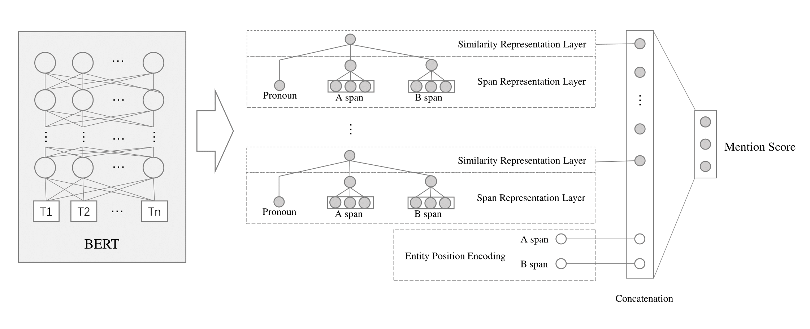
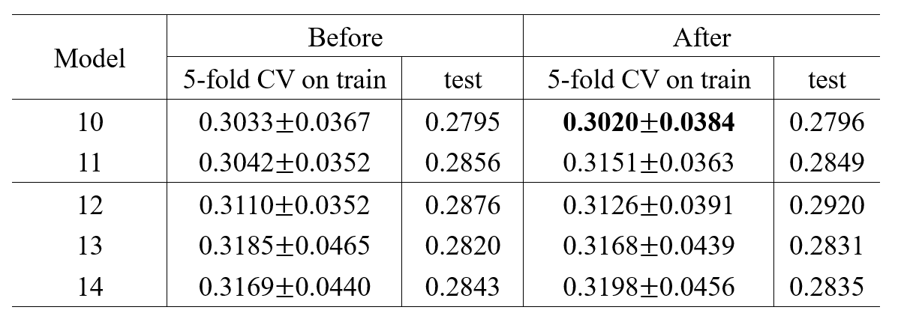

# MSnet: A BERT-based Mention Score Network for Gendered Pronoun Resolution

## Network Architecture

## training details

feature-based approach with meanpooling: https://www.kaggle.com/ziliwang/feature-based-approach-with-meanpooling

feature-based approach with attention: https://www.kaggle.com/ziliwang/feature-based-approach-with-attention

fine-turning with attention: https://www.kaggle.com/ziliwang/fine-tuning-with-attention

## History:

2019-5-22: fixed bug of  tuning embedding layer in BERT

performance change:

training detail of fine-turning with attention (fixed): <https://www.kaggle.com/ziliwang/fork-of-fine-tuning-with-attention>
